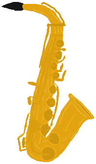
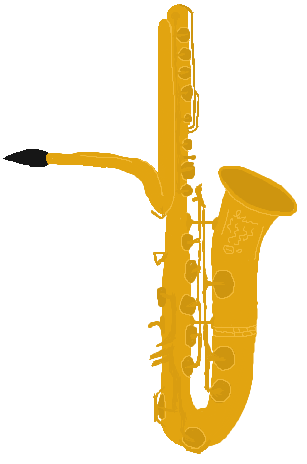
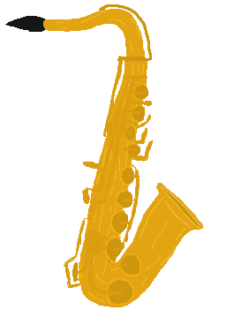

================================
A Short History of the Saxophone
================================

Invented by Adolphe Sax in Belgium, the saxophone was meant to be a balance between brass, woodwind, and string instruments. The saxophone combines a brass body and a woodwind mouthpiece.

   An Alto Saxophone

Adolphe Sax's C Bass Saxophone was the first to debut, appearing in a concert in France on February 3rd, 1844.

-------------------------------
After the 19th Century
-------------------------------
The popularity of the saxophone in France quickly rose that year. French military bands began to replace classic woodwind instruments with saxophone. As its popularity rose, the instrument changed. Keys added, rollers introduced. The introduction of jazz in the 1910s made saxophone an important part of pop culture.

Saxophone has continued to be a staple of jazz, while frequently featured in famous songs from different genres--from Pink Floyd to Jason Derulo.

------------------------------
Types of Saxophones
------------------------------

Although a more rare instrument since the turn of the 20th century, the saxophone first debuted by Adolphe Sax was a C Bass saxophone. The C Bass saxopone is unique for its long neck, huge body, and learning curve. It is one of the lowest saxophones, preceeding the contrabass and unplayable subcontrabass.

   A C Bass Saxophone

The most common saxophone is the alto saxophone (pictured earlier), and is the starting saxophone for new players. The second most common saxophone is the tenor saxophone and is lower than the alto but higher than the bass.

   The Tenor Saxophone--second most common

The third most popular saxophone is the baritone or bari. It is one of the lowest instruments in a normal symphonic band. It is lower than the tenor but higher than the bass.

----------------------
Other Saxophones
----------------------

The soprano saxophone is another common type, made famous by jazz player Kenny G. Unlike the alto, tenor, or bari, the soprano saxophone is not curved. It is higher than the alto but less than another unique saxophone, the soprissimo.

----------------------
Strange Saxophones
----------------------

There are hundreds of different saxophone types. Inventors and enthusiasts regularly come up with increasingly strange and unique types of saxophones. Metal, plastic, slap, straight, slide, all highly rare and interesting. One of the most interesting types is the "Triangular Bore Slide Saxophone." It has a unique mechanic of allowing the player to jiggle the horn to create a different sound. The slide on the saxophone flops back and forth as it is jiggled.

`Video of the Triangular Bore Slide Saxophone <https://www.youtube.com/watch?v=dNcd9Sk0gWc>`_